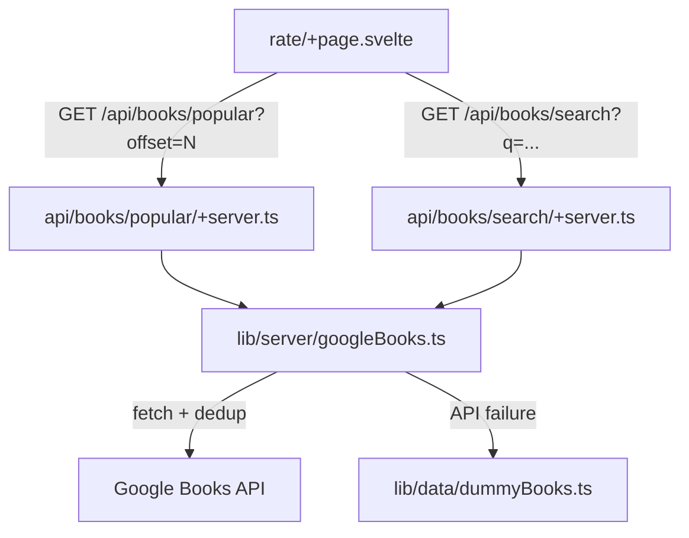

# Google Books API Integration

## Architecture




## Files to create / modify

- `[.env](.env)` — add `GOOGLE_BOOKS_API_KEY=...`
- `[src/lib/types/book.ts](src/lib/types/book.ts)` — add `year?: string` (summary already exists)
- `src/lib/server/googleBooks.ts` *(new)* — server-only Google Books client
- `src/routes/api/books/search/+server.ts` *(new)* — search endpoint
- `src/routes/api/books/popular/+server.ts` *(new)* — popular books endpoint
- `[src/routes/rate/+page.svelte](src/routes/rate/+page.svelte)` — replace dummy data, add lazy loading, spinner, error toast

---

## 1. `.env`

Add a private (non-`VITE_`) key:

```
GOOGLE_BOOKS_API_KEY=<your key>
```

---

## 2. Update `Book` type

```typescript
export interface Book {
  id: string;
  title: string;
  author: string;
  coverUrl?: string;
  summary?: string;
  year?: string;      // ← add this
}
```

---

## 3. `src/lib/server/googleBooks.ts`

Handles all Google Books API calls. Key responsibilities:

- Map `volumeInfo` fields → `Book` shape (id from `volumeId`, cover from `imageLinks.thumbnail`, author from `authors[0]`, year from `publishedDate.slice(0, 4)`, description from `description`)
- **Deduplication**: after fetching, build a `Map` keyed by `normalise(title) + normalise(firstAuthor)` — keep only the first hit per key. This mirrors Google Books' own canonical-edition ordering since results are already sorted by relevance.
- **Popular query**: `q=subject:fiction&orderBy=relevance` (single broad query, paginated via `startIndex`)
- Books without a cover are omitted from the popular list (but kept in search results with `coverUrl: undefined`)
- On any network or non-200 error, throws so callers can fall back

```typescript
const BASE = 'https://www.googleapis.com/books/v1/volumes';

export async function fetchPopularBooks(startIndex: number, maxResults: number): Promise<Book[]>
export async function searchBooks(query: string, maxResults: number): Promise<Book[]>
```

---

## 4. Server routes

### `src/routes/api/books/popular/+server.ts`

- Reads `?offset=N` from URL (default 0)
- Calls `fetchPopularBooks(offset, 30)` for the first load (offset=0), `20` for subsequent
- On error → falls back to `getStarterBooks()` from `dummyBooks.ts` and returns those
- Returns `json({ books, nextOffset })`

### `src/routes/api/books/search/+server.ts`

- Reads `?q=...` from URL
- Calls `searchBooks(q, 10)`
- On error → falls back to `searchBooks(q)` from `dummyBooks.ts`
- Returns `json({ books })`

---

## 5. Update `src/routes/rate/+page.svelte`

Replace all `dummyBooks` imports with API calls. Key changes:

**Popular books + lazy loading:**

- On mount, fetch `/api/books/popular?offset=0` → populate `popularBooks[]`
- Attach an `IntersectionObserver` to a sentinel `<div>` at the bottom of the popular list
- When sentinel enters viewport (and not already loading, and not in search mode), fetch `/api/books/popular?offset=popularBooks.length` and append
- Track `loadingMore` boolean to prevent duplicate requests and show a bottom spinner

**Search:**

- Fires when `debouncedQuery.length >= 3` (raised from current 0)
- Calls `/api/books/search?q=...`
- Shows spinner while in-flight; replaces popular list with results when done
- On clear (< 3 chars), returns to popular list

**Loading states:**

- `loadingInitial` → full-area skeleton / spinner on first paint
- `loadingSearch` → spinner above search results
- `loadingMore` → small spinner at bottom of popular list

**Error handling:**

- On API error, show an inline dismissable error banner (`role="alert"`) near the list
- Fallback data still shows (server already handles this), so the UI degrades gracefully

`**getBookById` in `ratedEntries`:**

- Currently resolves book objects from `dummyBooks`. Update to also look in `popularBooks` and `searchResults` arrays first, before falling back to dummy lookup.

---

## Deduplication detail

```
normalise(s) = s.toLowerCase().replace(/[^a-z0-9]/g, '')
key = normalise(title) + '|' + normalise(authors[0] ?? '')
```

Keep a `Set<string>` of seen keys; skip any volume whose key is already in the set.

---

## Lazy loading trigger

A `<div class="sentinel">` is placed after the last popular book card. The `IntersectionObserver` fires `loadMore()` when it becomes visible. The sentinel is hidden during search mode.